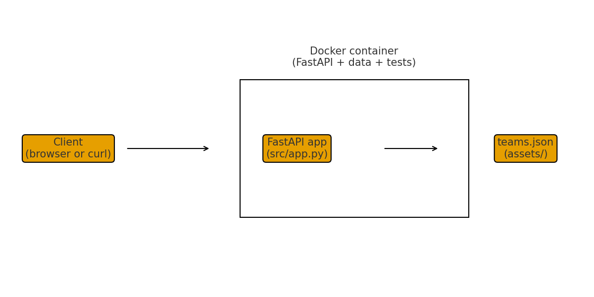

# NFL Team Stats API

## 1) Executive Summary

**Problem.**  
Build a small but complete backend service that works end to end. The system should serve data over HTTP, run easily on another machine, and be simple enough that the full codebase can be understood quickly. Public NFL team statistics provide a realistic dataset for demonstrating API design, data handling, and deployment.

**What I built.**  
Built a FastAPI service that exposes NFL team statistics through REST endpoints. The service loads structured data from JSON, validates requests, and returns consistent responses. It can be run locally with Python or inside a Docker container. Basic automated tests verify core functionality, and the project is structured so a new user can clone the repository, run a single command, and immediately interact with the API.

---

## 2) System Overview

This project is designed as a lightweight backend service with a clear separation between data loading, request handling, and deployment. The goal is to demonstrate how a simple system can be reliable, easy to run, and easy to reason about.

### Core concepts I used

- **FastAPI / serving APIs** – defining routes, returning JSON, running with `uvicorn`.
- **Docker** – building a container image with a `Dockerfile` and running it with a single script.
- **Configuration via env variables** – using `.env.example` and `LOG_LEVEL`.
- **Testing with pytest** – simple smoke tests that call the API.

### Architecture diagram

The diagram lives at `assets/nfl_api_architecture.png` and is also shown here:



In words: a client (browser, curl, etc.) talks to the FastAPI app in `src/app.py`. The app reads from `assets/teams.json` to answer requests. Code, data, and tests are all shipped together in a Docker image so it runs the same way everywhere.

### Data, models, and services

#### Data

- File: `assets/teams.json`
- Format: list of objects with  
  - `name`, `city`, `wins`, `losses`, `points_scored`, `points_allowed`
- Teams: Ravens, Commanders, Dolphins, Chiefs.
- How I created it: I entered the records and scoring numbers by hand, using public NFL stat sites (for example Pro‑Football‑Reference) as a rough guide. It’s a tiny, course‑size dataset, not a full official one.

#### Models

- There is no ML model here. Everything is just simple Python logic.

#### Service

The FastAPI app is in `src/app.py`. Key routes are:

- `GET /health` – quick health check with a status field and the current log level.
- `GET /teams` – returns the list of all teams.
- `GET /compare/{team_a}/{team_b}` – compares two teams (wins and points) and returns a small JSON summary. If you ask for a team that doesn’t exist, you get a 404.

---

## 3) How to Run (Local)

### Option A – Python local run

1. Install dependencies:

   ```bash
   pip install -r requirements.txt
   ```

2. Start the development server:

    ```bash
   python3 -m uvicorn src.app:app --reload
    ```

3. Test in a new browser or terminal: 

    ```bash
    curl http://127.0.0.1:8080/health
    curl http://127.0.0.1:8080/teams
    ```

    ---

### Option B – Docker

Before running, make sure Docker Desktop is installed and running.

1. One‑time setup to make the script executable:

   ```bash
   chmod +x run.sh
   ```
2. Build the image and run the Docker container:

    ```bash
    ./run.sh
    ```

## 4) Design decisions

### Overall approach

I wanted something small, clear, and easy to understand. That drove almost every choice:

- keep the data in one JSON file instead of a database
- keep the API surface tiny (`/health`, `/teams`, `/compare/{team_a}/{team_b}`)
- make it easy to run the same way on any machine (Python or Docker)

The goal was not to build a full NFL stats platform, but a clean example that uses core DS concepts end‑to‑end.

### Tech stack and project layout

- **FastAPI + Uvicorn**  
  I picked FastAPI because it’s lightweight, has simple decorators for routes, and returns JSON by default. Uvicorn is the recommended ASGI server, so I followed that pattern.
- **Project structure**  
  I put the code in `src/`, data in `assets/`, and tests in `tests/`. This keeps the roles separate:
  - `src/app.py` – the API
  - `assets/teams.json` – the “database”
  - `tests/test_smoke.py` – quick checks that the API works

This layout is simple but matches how larger Python projects are usually organized.

### Data choices

- **Local JSON file instead of live NFL API**  
  I decided to store the data in `assets/teams.json` rather than call a public NFL API. That has a few benefits:
  - no network calls, so the app is fast and works offline
  - tests are fully deterministic
  - no need for API keys or rate‑limit handling
- **Tiny dataset**  
  The file only includes four teams (Ravens, Commanders, Dolphins, Chiefs) with wins, losses, points scored, and points allowed. I entered the numbers by hand using public NFL stat sites as a rough guide. This keeps the focus on the API and containerization, not data wrangling.

Tradeoff: this is obviously not complete NFL coverage, but it is enough to demonstrate the design.

### API design and error handling

I kept the endpoints small on purpose:

- `GET /health` returns a simple JSON status plus the current `LOG_LEVEL`. This is helpful for both grading and basic monitoring.
- `GET /teams` returns the full list of teams.
- `GET /compare/{team_a}/{team_b}`:
  - looks up both teams by name (case‑insensitive)
  - returns a short JSON summary comparing wins and point totals
  - returns a 404 with a clear error message if either team name is not found

This design shows route parameters, basic validation, and how to return proper HTTP status codes, without turning into a huge project.

### Configuration and environment variables

The app reads configuration from the environment:

- `LOG_LEVEL` – controls how chatty the service is about logging
- `API_KEY` – placeholder to show where a real secret would go

To keep secrets out of the repo, I added `.env.example` instead of a real `.env`. This follows the “no secrets in Git” rule while still showing how env‑based config works.

### Docker and reproducibility

The assignment asked for a containerized, reproducible run, so I added:

- `Dockerfile` – builds a small image with Python, installs `requirements.txt`, and runs `uvicorn src.app:app`
- `run.sh` – one‑command script that:
  - builds the image
  - runs the container on port `8080`
  - passes env vars from `.env.example`

This means the user can choose either local Python (Option A) or Docker (Option B), and they should see the same behavior.

### Testing approach

I wrote simple smoke tests in `tests/test_smoke.py` using `pytest`:

- `test_health()` checks `/health` returns HTTP 200 and `"status": "ok"`.
- `test_teams_list()` checks `/teams` returns HTTP 200 and a non‑empty list.

These tests are intentionally small. The idea is to prove the service actually runs and returns JSON, not to build a full test suite.

### Simplifications and non‑goals

To keep the scope reasonable for this class project, I **did not**:

- store data in a real database (no Postgres, etc.)
- implement authentication or rate limiting
- expose every possible NFL team or stat
- deploy to cloud; everything runs on localhost or via Docker

These are natural next steps (see the “What’s next” section), but they were out of scope for this case study.


## 5) Results & Evaluation

### Sample outputs

Below are a few real responses from the running API (pretty‑printed here for readability).

GET `/health`:

    {
      "status": "ok",
      "log_level": "info"
    }

GET `/teams` (truncated):

    [
      {
        "name": "Ravens",
        "city": "Baltimore",
        "wins": 11,
        "losses": 6,
        "points_scored": 421,
        "points_allowed": 312
      },
      {
        "name": "Commanders",
        "city": "Washington",
        "wins": 12,
        "losses": 5,
        "points_scored": 389,
        "points_allowed": 344
      },
      ...
    ]

GET `/compare/Ravens/Chiefs`:

    {
      "team_a": "Ravens",
      "team_b": "Chiefs",
      "better_record": "Ravens",
      "points_scored_diff": 23,
      "points_allowed_diff": -11
    }

These examples show that the API is serving the JSON data from `assets/teams.json` correctly and that the comparison route is doing basic validation and math.

### Performance and footprint

This is a very small FastAPI app:

- No external database or queue; everything is in memory from a single JSON file.
- The Docker image only installs Python, FastAPI, Uvicorn, and pytest.
- On my laptop, calls to `/health` and `/teams` return almost instantly using `curl`, with no noticeable latency.

For this project scale, there are no obvious performance bottlenecks; the limiting factor would just be how many concurrent requests Uvicorn can handle.

### Validation and tests

I wrote simple smoke tests with `pytest` in `tests/test_smoke.py`:

- `test_health()`  
  - Sends a GET request to `/health`.  
  - Asserts HTTP 200.  
  - Asserts the JSON body has `"status": "ok"`.

- `test_teams_list()`  
  - Sends a GET request to `/teams`.  
  - Asserts HTTP 200.  
  - Parses the response JSON and checks:
    - The result is a list.
    - The list has at least one team.

How to run the tests:

    python3 -m pytest tests/test_smoke.py

Current outcome:

- All tests pass (`2 passed`), which confirms:
  - The service starts correctly.
  - The two main routes (`/health` and `/teams`) respond with valid JSON and expected shapes.

## 6) What’s Next

- **Add more teams and seasons.**  
  Grow `assets/teams.json` to cover all NFL teams, and maybe multiple seasons. Add simple filters so callers can ask for a single team or season.

- **Pull stats from a real source.**  
  Replace the hand‑typed JSON with a small script that downloads stats from a public site (CSV or API) and regenerates `teams.json`. This keeps the API data fresh and makes the dataset less toy‑like.

- **Improve comparisons.**  
  Extend `/compare/{team_a}/{team_b}` with extra numbers such as point differential, average points per game, or a small “who is hotter lately” summary. Tighten the 404 messages so bad team names are easier to debug.

- **Logs and basic metrics.**  
  Add structured logging for each request (path, status code, response time) and consider a simple `/metrics` or log summary endpoint so it is easier to see how the service is behaving.

- **Optional cloud deploy.**  
  Push the Docker image to a registry and deploy it to a small cloud service (for example a cheap VM or container host) so the user could hit a live URL in addition to running it locally.

---

## 7) Links (Required)

GitHub repo: <https://github.com/fje9hz/nfl-api>  


## 8) Credits & AI Use

I used ChatGPT‑5.1 Pro and Cursor as study partners while working on this project. They helped with brainstorming, drafting text, and reminding me of FastAPI and Docker syntax. I reviewed, edited, and tested all code myself, and I am responsible for the final version.

The team statistics in `assets/teams.json` were typed in by me, using public NFL stat websites (such as Pro‑Football‑Reference) as a rough reference for realistic scoring and records. This dataset is only intended for educational use in this course.

No secrets are included in this repository. Configuration is handled through environment variables with a safe `.env.example` template.

